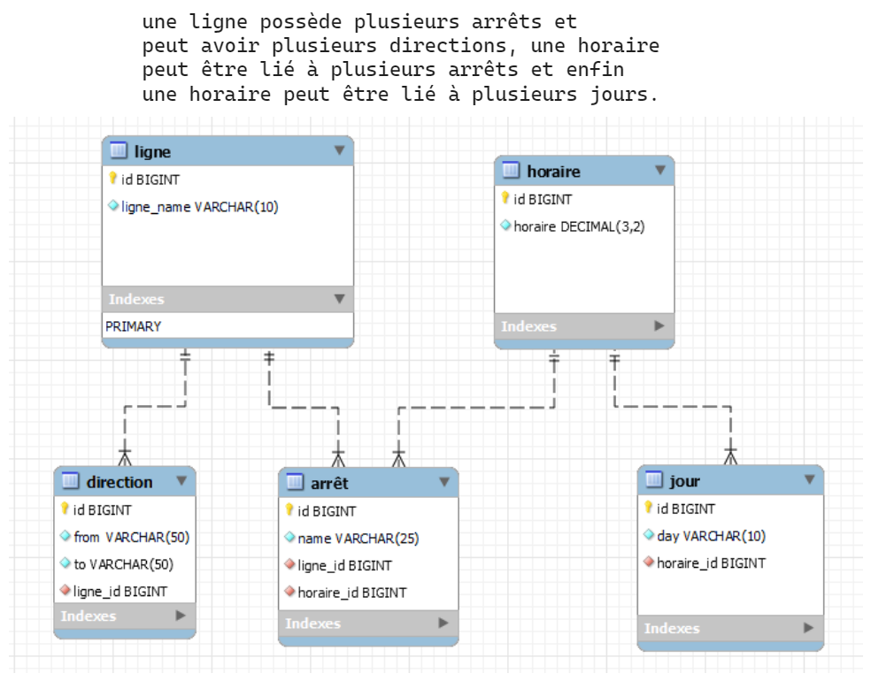

# Table des matières

1. [Installation et Utilisation](#installation)
2. [Conception](#conception)
3. [Référence](#référence)

# Installation et utilisation
Pré-requis : vous devez disposer d'un environnement de développement opérationnel c'est à dire avoir au préalable installer 
mysql, et avoir un environnement github pour pouvoir cloner le dépôt.

## 1. Clonage du projet

Sur votre machine, cloner le dépôt grâce à la commande :

```bash
git clone git@github.com:imPayne/sql_project_mds.git
```
via la clé ssh ou via le lien https
```bash
git clone https://github.com/imPayne/sql_project_mds.git
```

```bash
code .
```

## 2. Retournez sur le terminal et ouvrez le terminal mysql avec la commande : 

```bash
sudo mysql -u "nom de votre utilisateur" -p
```

## 4. Créez la database et allez dessus : 

```bash
CREATE DATABASE evalsql;
```

```bash
use evalsql;
```

## 5. Retournez sur visual studio, faite un clic droit sur le fichier schema.sql, sélectionnez "Copy path" puis retournez sur le terminal et effectuez cette commande : 

```bash
source "Collez le path que vous avez copié dans VsCode"
```

## 6. Effectuez la même étape mais pour le fichier data.sql 

```bash
source "Collez le path que vous avez copié dans VsCode"
```

## 6. Effectuez la même étape mais pour le fichier queries.sql et admirez le résultat !

```bash
source "Collez le path que vous avez copié dans VsCode"
```


## Conception <a name="conception"></a>
MCD réalisé avec mysql workbench:




## Référence
- https://stackoverflow.com/
- https://dev.mysql.com/doc/