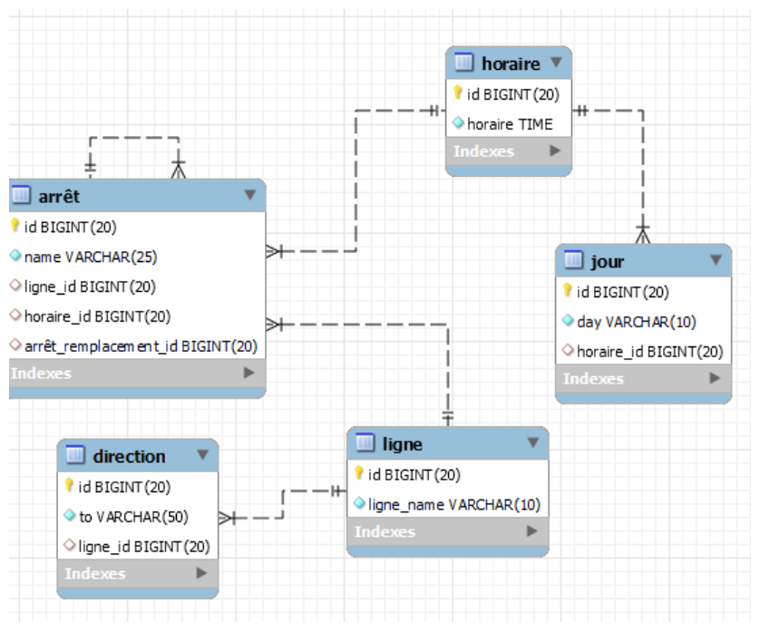

# Table des matières

1. [Installation et Utilisation](#installation)
2. [Conception](#conception)
3. [Référence](#référence)

# Installation et utilisation
Pré-requis : vous devez disposer d'un environnement de développement opérationnel c'est à dire avoir au préalable installer 
mysql, et avoir un environnement github pour pouvoir cloner le dépôt ainsi qu'avoir mysql workbench d'installer

## 1. Clonage du projet

Sur votre machine, cloner le dépôt grâce à la commande :

```bash
git clone git@github.com:imPayne/sql_project_mds.git
```
via la clé ssh ou via le lien https
```bash
git clone https://github.com/imPayne/sql_project_mds.git
```


## 2. Ouvrez tous les fichiers .sql contenue dans le repo (queries.sql, schema.sql, data.sql) : 
Exécuter le fichier schema.sql depuis mysql workbench en faisant ctrl + a dans le fichier et en cliquant sur l'éclair de gauche en haut du fichier dans la partie outil.
Ensuite réaliser la même manipulation avec le fichier data.sql pour pouvoir insérer les données.
Les queries sont dans le fichier queries.sql, pour pouvoir les utiliser il suffit de sélectionner chaque querie une après l'autre 
et de cliquer sur l'éclair pour voir le résultat de la querie.

## Conception <a name="conception"></a>
MCD réalisé avec mysql workbench:




## Référence
- https://stackoverflow.com/
- https://dev.mysql.com/doc/